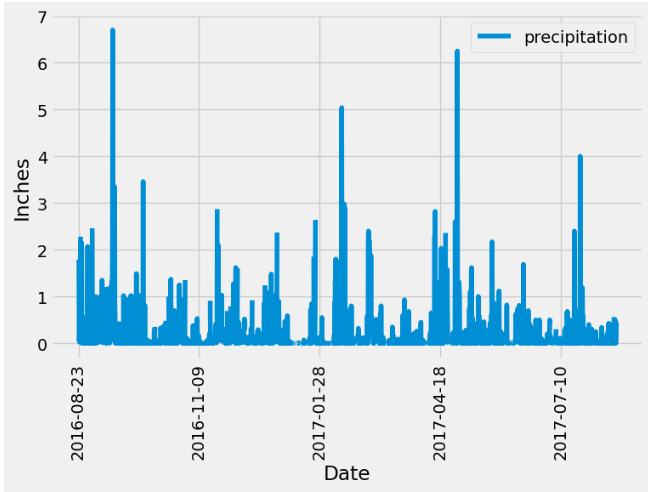
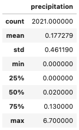
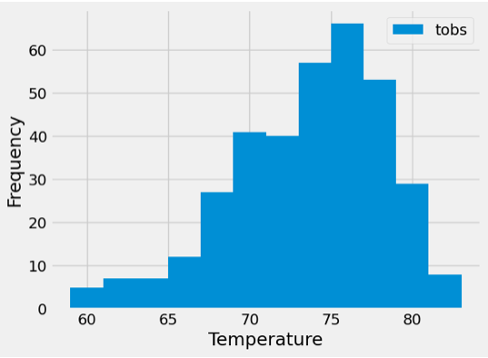

# sqlalchemy-challenge
This project is to help with trip planning and climate analysis about the area for a long holiday vacation in Honolulu, Hawaii.

The SurfsUp directory contains climate.ipynb Jupyter Notebook, the app.py Python script, and a Resources folder which contains the hawaii.sqlite database, hawaii_measurements.csv and hawaii_stations.csv.

## Part 1: Analyze and Explore the Climate Data
Climate analysis and data exploration was done on the hawaii.sqlite database. The climate.ipynb Jupyter Notebook was created to perform precipitation analysis and station analysis. 

### Precipitation Analysis

* ORM queries were done to get the date and prcp data for the previous 12 months.

* Pandas DataFrame was created using the queried data.

* The results were plotted by using the Pandas plot method.

* A summary statistics table was printed for the precipitation data for the previous 12 months.

### Station Analysis

* ORM queries were done to get the most active stations.

* Queries were done to get the previous 12 months of temperature observation (TOBS) data for the most active station.

* The results were plotted as a histogram.

## Part 2: Design Your Climate App

The app.py Python script was created to design a climate app with a Flask API with 5 routes with JSON lists of climate information. The following 5 routes are available routes created using Flask:

1. `/`(Homepage)
* Start at the homepage.
* List all the available routes.

2. `/api/v1.0/precipitation` (Precipitation)
* Convert the query results from your precipitation analysis (i.e. retrieve only the last 12 months of data) to a dictionary using date as the key and prcp as the value.
* Return the JSON representation of your dictionary.

3. `/api/v1.0/stations` (Stations)
* Return a JSON list of stations from the dataset.

4. `/api/v1.0/tobs` (TOBS)
* Query the dates and temperature observations of the most-active station for the previous year of data.
* Return a JSON list of temperature observations for the previous year.

5. `/api/v1.0/<start>` and `/api/v1.0/<start>/<end>` (minimum, average, and maximum temperatures for a specific date range)
* Return a JSON list of the minimum temperature, the average temperature, and the maximum temperature for a specified start or start-end range.
* For a specified start, calculate minimum, average, and maximum temperatures for all the dates greater than or equal to the start date.
* For a specified start date and end date, calculate minimum, average, and maximum temperatures for the dates from the start date to the end date, inclusive.